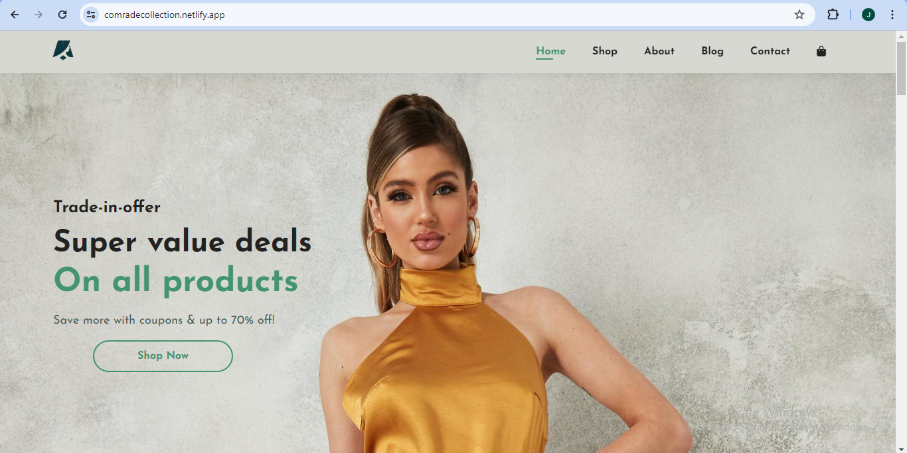
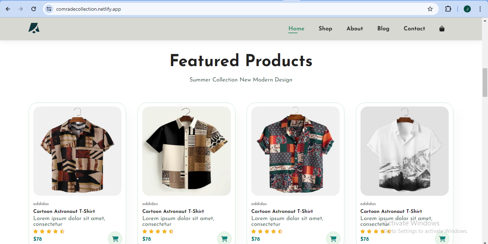
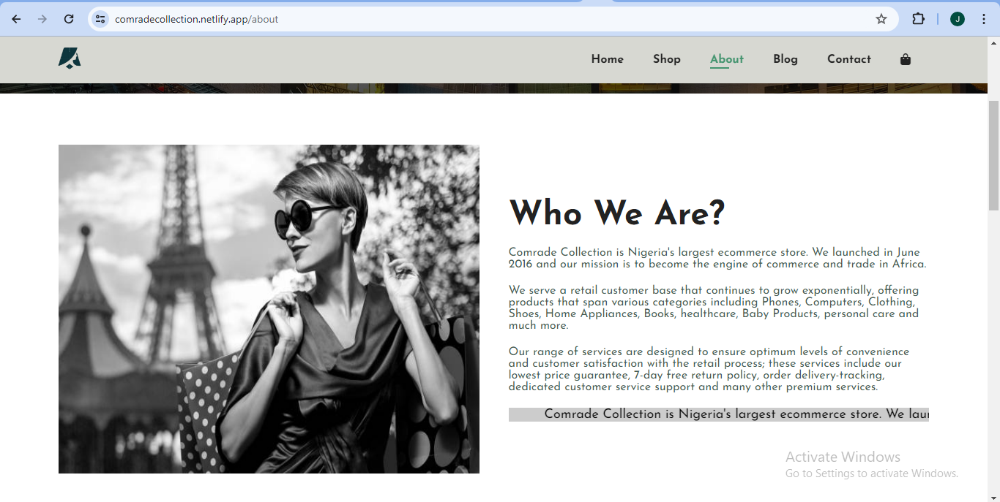
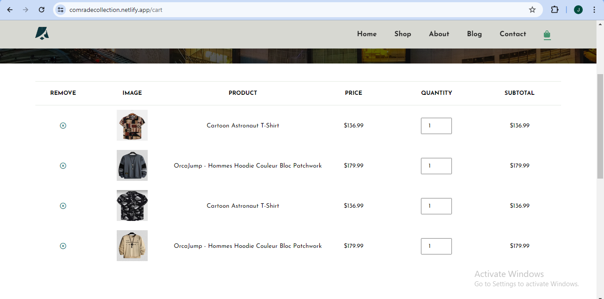

## Project Documentation (Comrade Collection)

Comrade Collection is an e-commerce website built with HTML, CSS, and JavaScript. I choose to work on this project to polish my already existing skills in front-end web development. The project was developed on the front-end level highlighting the basic and common features of an e-commerce web application. 

On the navigation menu, we have the home, shop about, blog, contact, and cart page. This e-commerce store focuses on fashion and clothing accessories ranging from male and female wear. The pages on this website are structured using HTML and styled with CSS alongside JavaScript for its functionality. It is responsive on tablets and mobile devices aside from desktops. 

This personal project has given me in-depth experience on how I can use CSS Flexbox for positioning and customizing each layout on the webpage. Each page has a hero image that provides the user with a preview of what the content of the page is all about. On the About page, I attached a video showing how the app can be downloaded. The contact page provides a detailed map along with a form to reach out to any of the team members. The cart page (the bag icon) offers a summary and subtotal of the items that were previously added to the cart before proceeding to the checkout.  

- Live Site URL: [comrade collection](https://comradecollection.netlify.app/)
-The video on this page was gotten from iStock by getty images

### Screenshot

## About

## Cart

